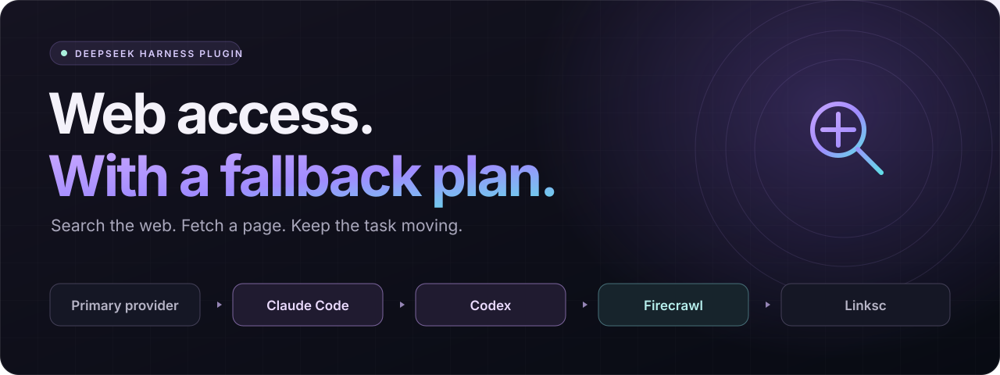
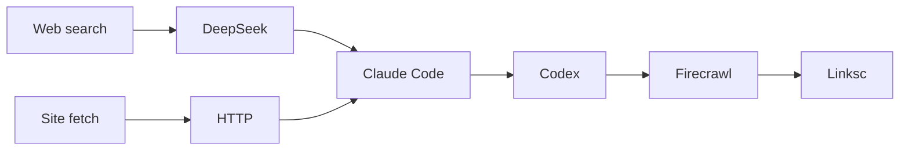

<div align="center">



# DSH Web Fallbacks

**Reliable web search and site fetch for DeepSeek Harness.**

One plugin. Four fallback backends. Your existing CLI logins.

[](https://github.com/ahnafnafee/dsh-web-fallbacks/actions/workflows/test.yml)
[](https://nodejs.org/)
[](./package.json)
[](./LICENSE)

[Quick start](#-quick-start) · [Features](#-features) · [Configuration](#-configuration) · [Validation](#-validation) · [Troubleshooting](#-troubleshooting)

</div>

<br />

## ✨ Features

When a search provider is unavailable, returns prose instead of source JSON, or runs out of time, the next provider takes over. The same chain retrieves page content when a direct HTTP fetch fails or returns an almost-empty page.

<table>
<tr>
<td width="50%" valign="top">

### 🔎 Search that returns sources

Claude Code uses a JSON schema; Codex uses structured output and native live web search. Results share DSH's URL, title, and snippet format.

</td>
<td width="50%" valign="top">

### 📄 Site fetch in both CLIs

Claude Code calls WebFetch. Codex opens the requested URL through its native web tool. Firecrawl and Linksc provide additional retrieval options.

</td>
</tr>
<tr>
<td valign="top">

### 🔁 Ordered recovery

Missing executables, provider errors, malformed replies, and empty results fall through automatically. Firecrawl always precedes Linksc.

</td>
<td valign="top">

### ⏱️ Time for the whole chain

Each provider has a deadline. Model-facing tool budgets allow later fallbacks to run, while caller cancellation stops the entire request.

</td>
</tr>
<tr>
<td valign="top">

### 🔐 Existing authentication

Headless calls use the installed CLIs and their saved logins. Optional MCP endpoints and credentials stay in your local DSH configuration.

</td>
<td valign="top">

### 🧩 Small, inspectable plugin

One JavaScript module, two JSON schemas, and no npm dependencies. Includes offline regression tests and opt-in live integration tests.

</td>
</tr>
</table>

## 🧭 How it works



Arrows represent fallback attempts. The first valid result ends the request. Unconfigured MCP backends are skipped; an unavailable primary provider is skipped too.

| Operation | Primary | Fallback order |
| --- | --- | --- |
| Search | `deepseek-official` | Claude Code → Codex → Firecrawl → Linksc |
| Fetch | `http` | Claude Code → Codex → Firecrawl → Linksc |

Both chains register under the existing DSH provider ID **`claude-code`**, which keeps the configuration compatible with earlier versions of the plugin.

## 🚀 Quick start

### 1. Check prerequisites

- [DeepSeek Harness](https://github.com/deepseek-ai/deepseek-harness) with its `web` service and web tools enabled.
- Node.js **22.12 or newer**.
- Authenticated [Claude Code](https://code.claude.com/docs/en/overview) and [Codex CLI](https://developers.openai.com/codex/cli/) installations for their respective backends.
- Optional Firecrawl and Linksc MCP endpoints for the later fallbacks.

The headless integrations were exercised with DSH `0.1.5-rc.1`, Claude Code `2.1.273`, and Codex CLI `0.154.0`. CLI flags and DSH internals can change; see [compatibility notes](./docs/configuration.md#compatibility).

### 2. Clone and test

```sh
git clone https://github.com/ahnafnafee/dsh-web-fallbacks.git
cd dsh-web-fallbacks
npm test
```

No dependency installation or build step is needed.

### 3. Connect it to DSH

Print a configuration snippet using the absolute file URL of your checkout:

```sh
node scripts/print-config.mjs
```

Merge the printed entries into **`~/.dsh/cordis.patch.yml`**. If the same IDs already exist, update those entries. The [example configuration](./examples/cordis.patch.example.yml) shows the structure without machine-specific paths or credentials.

Keep the checkout in place: DSH loads the module and both schemas from it. Restart DSH after the initial installation. If your agent preset owns the web tool definitions, enable `fetch: true` in that preset's `tool-web` configuration as well.

### 4. Try both operations

In a DSH session, ask:

```text
Search the web for the official Node.js test runner documentation.
```

```text
Fetch https://example.com/ and show the page text.
```

To exercise the headless backends directly with your saved CLI logins:

```sh
npm run test:live
```

Live tests contact external services and consume the corresponding account quotas.

## ⚙️ Configuration

The plugin's `config` object controls the provider chain. These are the most common settings:

| Option | Default | Purpose |
| --- | --- | --- |
| `bin` / `model` | `claude` / `haiku` | Claude Code executable and model |
| `codexBin` / `codexModel` | `codex` / `gpt-5.6-sol` | Codex executable and model; `codexBin: ""` disables it |
| `primary` | `deepseek-official` | First search provider; `""` skips it |
| `fetchPrimary` | `http` | First fetch provider; `""` skips it |
| `firecrawlMcpUrl` | `""` | Streamable HTTP endpoint exposing `firecrawl_search` and `firecrawl_scrape` |
| `linkscMcpUrl` | `""` | Streamable HTTP endpoint exposing `search` and `fetch` |
| `linkscHeaders` | `{}` | Headers required by your Linksc deployment |

Set the MCP URLs in your **local** DSH patch to enable those backends. The chain calls their MCP endpoints directly; separate DSH MCP plugin registrations are optional if you also want their tools exposed individually.

<details>
<summary><strong>Provider timeouts and complete configuration reference</strong></summary>

| Provider | Search | Fetch |
| --- | ---: | ---: |
| Primary | 5 s | 15 s |
| Claude Code | 25 s | 60 s |
| Codex | 40 s | 45 s |
| Firecrawl | 20 s | 30 s |
| Linksc | 20 s | 20 s |
| **Model-facing tool budget** | **120 s** | **180 s** |

The defaults leave time for the full chain. Increase the overall tool budget if you increase individual provider deadlines.

See [the configuration reference](./docs/configuration.md) for every option, MCP requirements, executable paths, and reload behavior.

</details>

## 🧪 Validation

`npm test` runs offline regression cases using local MCP servers and subprocess fixtures. `npm run test:live` also checks real Claude and Codex search and fetch calls, including a deliberately unavailable Claude executable to force the Codex path.

The public package passed **all 29 tests**, including its live CLI checks with generic documentation queries. The underlying implementation also passed **six in-server live checks** before packaging. GitHub Actions runs the offline suite on Linux and Windows with Node.js 22 and 24.

Coverage includes schema enforcement, prose-only replies, provider ordering, failed subprocesses, empty results, bounded timeouts, caller cancellation, MCP response parsing, and page retrieval. See [validation notes](./docs/validation.md) for the scope and limits of the live checks.

## 🛠️ Troubleshooting

| Symptom | What to check |
| --- | --- |
| `could not run` | Confirm the CLI is on DSH's `PATH`, or set `bin` / `codexBin` to the executable's absolute path. |
| Authentication or quota error | Run the affected CLI interactively to check its login and account status. |
| Old parsing error after editing the plugin | Restart DSH, or change the version suffix on the **absolute file URL** so the loader imports fresh code. |
| No `web_fetch` tool in a session | Enable `fetch: true` on that agent preset's `tool-web` entry, then create or reload the session. |
| A fallback never gets time to run | Keep the tool budget larger than the sum of provider deadlines. |
| MCP 401, 502, or timeout | Check that endpoint and its credentials directly. Failures advance to the next configured provider. |

Fetched text is limited by the backend's retrieval and output capabilities. Claude and Codex may transform or limit long pages; their successful wrappers report HTTP 200 because the CLI output does not expose the origin's HTTP status. Use a direct fetch or scrape backend when exact bytes or origin status are required.

## 🤝 Contributing

Bug reports and focused pull requests are welcome. Include a generic reproducer, the relevant CLI versions, and what you verified. See [CONTRIBUTING.md](./CONTRIBUTING.md).

## 📄 License

[MIT](./LICENSE).

<div align="center">

<br />

**Keep your web tools moving.**

[Report an issue](https://github.com/ahnafnafee/dsh-web-fallbacks/issues) · [Browse the source](./web-search-claude-code.mjs) · [Back to top](#dsh-web-fallbacks)

</div>
